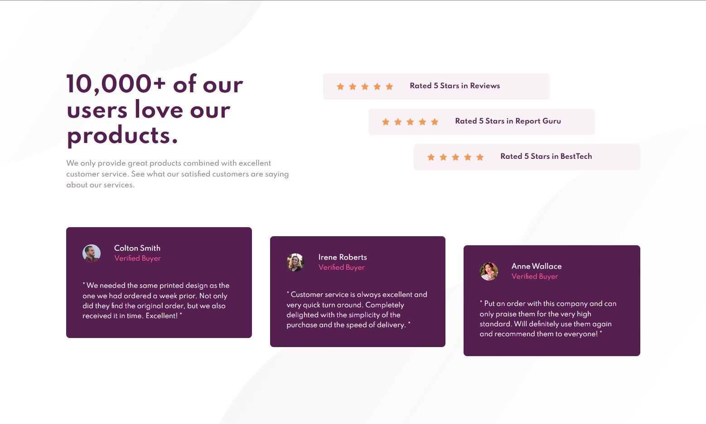

# Frontend Mentor - Social proof section solution

This is a solution to the [Social proof section challenge on Frontend Mentor](https://www.frontendmentor.io/challenges/social-proof-section-6e0qTv_bA).

## Table of contents

- [Overview](#overview)
  - [The challenge](#the-challenge)
  - [Screenshot](#screenshot)
  - [Links](#links)
- [My process](#my-process)
  - [Built with](#built-with)
- [Author](#author)

## Overview

### The challenge

Users should be able to:

- View the optimal layout for the section depending on their device's screen sizes

### Screenshot

### Links

- Solution URL: [Add solution URL here](https://github.com/m00nta/social-proof-section-master)
- Live Site URL: [Add live site URL here](https://m00nta.github.io/social-proof-section-master/)

## My process

### Built with

- Semantic HTML5 markup
- CSS custom properties
- Flexbox
- CSS Grid

## Author

- Frontend Mentor - [@m00nta](https://www.frontendmentor.io/profile/m00nta)
- Twitter - [@m00nta](https://twitter.com/m00nta)
